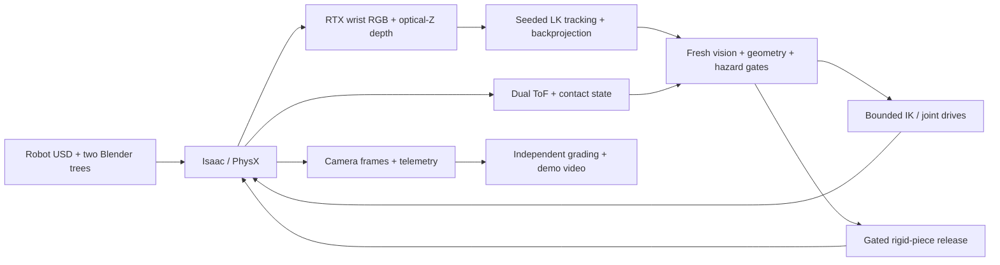

# Robotic pruning

Simulate UR5e vision-guided branch release in a textured, two-tree orchard.

[](https://github.com/joses2017smjh/isaac-sim-pruning-workflow/releases/download/isaac-vision-2026-09-13/isaac_two_trees_vision_sequence.mp4)

[Watch the 20-second demo](https://github.com/joses2017smjh/isaac-sim-pruning-workflow/releases/download/isaac-vision-2026-09-13/isaac_two_trees_vision_sequence.mp4)
· [Wrist-camera video](https://github.com/joses2017smjh/isaac-sim-pruning-workflow/releases/download/isaac-vision-2026-09-13/isaac_two_trees_vision_sequence_wrist.mp4)
· [Measured results](docs/evidence/two_tree_summary_2026-09-14.json)
· [Capture guide](docs/ISAAC_RENDER.md)

## Problem

A pruning arm has to approach a thin branch from wrist RGB-D and dual ToF,
then release only when tracking and geometry still agree. Jaw occlusion can
wipe out image features at the worst moment. A finished recording is not a
finished cut.

## Solution

Isaac Sim 6.0 / Lab 3 drives the original UR5e and mock pruner among both
source Blender trees. Seeded pyramidal Lucas–Kanade tracking back-projects RTX
optical-Z depth into bounded Cartesian commands. Dual 8×8 ray-cast ToF,
contact, and geometry gates must pass before a visual-jaw surrogate releases
one rigid spur. An independent grader scores the saved capture; it does not
trust the renderer’s success label.

Branch identity, axis, and radius come from mesh metadata. Subsequent positions
come from image tracking and simulator depth, not learned recognition. This is
a discrete rigid-piece release, **not wood fracture**.

## Result

Job `21328323` applies **68 vision commands**, releases one selected spur at
**7.8 s**, measures **809.49 mm of fall**, and returns within **0.001 mm** of
home. All **17 independent sequence checks** pass. That is one known target,
not pruning both trees or a measured success rate.

Then show the [closure failure](https://github.com/joses2017smjh/isaac-sim-pruning-workflow/releases/download/isaac-vision-2026-09-13/isaac_two_trees_closure_failure.mp4):
tracking confidence falls below 0.15 at 7.7 seconds; motion stops without
release. [Failure GIF](docs/demo/isaac_two_trees_closure_failure.gif).
Tracking loss *after* a completed release is allowed during home-directed
retreat; the success dashboard preserves that state instead of hiding it.

Show one **20-second loop**. Pause the wrist video at **7.8 seconds** for
release, then resume through the return.

## Quickstart

The CPU demo requires Git and Python 3.10+ with `venv` on Linux or macOS.
It reproduces approach, sensor blackout and blocked-cut geometry. It does
**not** render the Isaac video above. Four commands:

```bash
git clone https://github.com/joses2017smjh/isaac-sim-pruning-workflow.git pruning
python3 -m venv pruning/.venv
pruning/.venv/bin/python -m pip install --extra-index-url https://download.pytorch.org/whl/cpu -e 'pruning/source/isaaclab_pruning[demo,dev,render]'
pruning/.venv/bin/python pruning/tools/run_pruning_demo.py --output-dir pruning/demo-output
```

Open `pruning/demo-output/pruning_demo.html`. It contains an 18-second GIF and
sensor-frame scrubber. [CPU capture instructions](docs/DEMO.md).
From `pruning/`, test with `.venv/bin/python -m pytest -q -m 'not isaacsim_ci'`.

The [Isaac path](docs/ISAAC_RENDER.md) requires the pinned GPU stack and external
robot/orchard assets. CI verifies the CPU path, not a clean-machine GPU installation.

## Architecture



[Environment](source/isaaclab_pruning/isaaclab_pruning/sim/pruning_env.py)
→ [capture](hpc/inner/render_pruning_workflow.py)
→ [sequence grader](tools/validate_vision_sequence.py)
→ [compositor](tools/compose_isaac_workflow.py).

The scene comes from `.blend` → USD, not PLY. Farneback flow is an offline
diagnostic. Same-depth feature maintenance runs only while tracking is valid;
new corners must pass the next frame's tracking gates.

## Evidence

| Check | Result | Limit |
|---|---|---|
| Two-tree sequence, `21328323` | 200 frames / 20 s; 68 applied vision commands; 262.94 mm tool displacement | One selected spur; visual jaw proxy, no physical blade actuation |
| Independent task grade | 17/17 checks; release at 7.8 s; 809.49 mm post-release drop; <0.001 mm final home error | Capture-rate evidence, not continuous contact safety |
| Two-tree tracking failure, `21316823` | Stops at 6.3 s after 63 commands | No closure, release or return |
| Two-tree closure failure, `21317409` | Confidence 0.14165 < 0.15 at 7.7 s; closure 2/3 | No release; failed recording preserved |
| Earlier one-tree approach, `21247873` | 60 commands / 6 s; 230.08 mm movement | Ended 35.01 mm from target at the mouth; no release |
| Earlier control smoke | 0.360 mm final error for a 5 mm command | Six-step hold; earlier floor-contact fixture drifted 20.12 mm and failed |
| CPU clear / blackout / blocked geometry | Accepted at 42 frames / stopped at 20 / rejected at 35 | Ideal tool motion |
| CPU range fusion | Nominal RMSE 6.08 → 5.49 mm; blackout 8.15 → 9.57 mm | Synthetic metric estimates; blackout coverage differs |
| Local CPU suite, September 19 | 514 passed; 9 skipped; 1 simulator test deselected | USD support absent in this CPU interpreter; GPU integration is separate |
| GitHub CI, checkpoint `68e37c5` | 451 passed; 9 skipped; 1 deselected | Clean runner without external runtime assets |

[Aggregate evidence](docs/evidence/two_tree_summary_2026-09-14.json)
· [Success and failure videos](https://github.com/joses2017smjh/isaac-sim-pruning-workflow/releases/tag/isaac-vision-2026-09-13)
· [HPC ledger](SLURM_JOBS.md).

RTX path tracing and OptiX denoising replace the older grainy capture settings.
No compositor median filter is applied. Ground relief is visual over a flat
collider; material/lighting conversion is not Blender Cycles parity.
[Morning/evening presets](docs/ISAAC_RENDER.md#daylight-variants) change the
simulated sun, not the source scene.

A six-run [lighting/tracker pilot](docs/RESEARCH_EXPERIMENTS_2026-09-19.md)
is queued as array **21360571** to compare the current tracker with opt-in
CLAHE contrast normalization. It uses
full sequences, frozen source/asset hashes, independent grades and one GPU at a
time. Short morning/evening probes already contain 30 valid frames each; they
do not complete pruning. See the [current queue](SLURM_JOBS.md).

Remaining: full daylight task validation, broader targets and failure trials,
learned perception, executed CuRobo/PPO baselines, physical camera calibration,
actuated blades and cutting mechanics.
The [browser-studio proposal](docs/ROBOT_STUDIO_PLAN.md) starts with recorded
trajectory replay. A local uncommitted prototype is preserved separately from
this experiment work; there is no trained policy to run in the browser yet.
[Implementation gates](docs/ROADMAP.md) · [Reviewer gaps](docs/REVIEWER_NOTES.md).

## Stack

- Python, PyTorch, NumPy, PyYAML
- Isaac Sim 6.0.0.1, Isaac Lab 3.0.0b2, USD, Warp, PhysX
- Blender 4.2.19 LTS, UsdPreviewSurface
- OpenCV, Pillow, Matplotlib, ffmpeg
- Slurm, Apptainer, pytest, Ruff, GitHub Actions

Jose Sanchez · Oregon State University · [Provenance and licensing](NOTICE.md)
