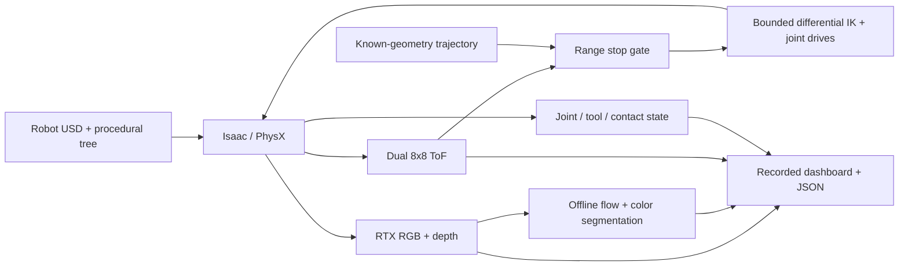

# Robotic pruning

Simulate a UR5e inspecting branches with wrist vision and dual-ToF sensing in Isaac Sim.

[](https://github.com/joses2017smjh/isaac-sim-pruning-workflow/releases/download/isaac-inspection-2026-09-07/isaac_workflow.mp4)

[Watch the 14-second video](https://github.com/joses2017smjh/isaac-sim-pruning-workflow/releases/download/isaac-inspection-2026-09-07/isaac_workflow.mp4)
· [Full-size dashboard](docs/demo/isaac_workflow.png)
· [Failed run and reproduction](docs/ISAAC_RENDER.md)

Actual Isaac/PhysX motion: observe → approach → align → inspect → retreat.
The dashboard shows RTX wrist RGB and depth, two live 8×8 ToF grids, joint/tool
state, and offline optical flow and color segmentation. Motion uses known
geometry with a ToF stop gate—not a vision policy. **No wood is cut.**
The GIF samples the full recording; the MP4 keeps all 140 frames at 10 fps.
Show one 14-second loop, then pause at 7 seconds to explain the sensor panels.
The tree in this published inspection is a procedural USD fixture.

New integration checkpoints:

| Recording | What it demonstrates |
|---|---|
| [3-second path-traced quality probe](docs/demo/isaac_quality_probe_unfiltered.gif) | Smoother RTX rendering of the procedural scene; OptiX denoising, no compositor filter; no cut |
| [6-second original Blender scene: stopped failure](docs/demo/isaac_textured_scene_failed_vision.gif) | Original meshes, bark/soil image maps, posts and wires load; contact and tool occlusion prevent vision-driven approach |

The Blender path exports the existing `.blend` scene to USD with UVs and image
textures; it does not import `.ply` files. Its classical LK tracker uses live
RGB and measured RTX depth to supply the next bounded control command. The first
recording issued zero vision-driven approach commands and never closed or
detached a branch. Revised placement and target component `8235` at 150° yaw
still await a passing GPU recording. [Evidence, limitations and reproduction](docs/ISAAC_RENDER.md).

## Quickstart

The portable CPU demo runs without Isaac, a GPU, robot assets, or a tree dataset.
It reproduces approach, sensor-blackout, and blocked-cut geometry scenarios;
it does **not** produce the Isaac robot video above. Requires Git and Python
3.10+ with `venv` on Linux or macOS. Four commands:

```bash
git clone https://github.com/joses2017smjh/isaac-sim-pruning-workflow.git pruning
python3 -m venv pruning/.venv
pruning/.venv/bin/python -m pip install --extra-index-url https://download.pytorch.org/whl/cpu -e 'pruning/source/isaaclab_pruning[demo,dev,render]'
pruning/.venv/bin/python pruning/tools/run_pruning_demo.py --output-dir pruning/demo-output
```

Open `pruning/demo-output/pruning_demo.html` locally. It includes an 18-second
GIF and a sensor-frame scrubber. [CPU capture instructions](docs/DEMO.md).
From `pruning/`, test with `.venv/bin/python -m pytest -q -m 'not isaacsim_ci'`.

To render the robot, follow the [Isaac recording guide](docs/ISAAC_RENDER.md).
That path requires the pinned GPU/container stack and externally generated
robot USD. CI tests the CPU path, not the GPU installation.

## Architecture

Published inspection:



[Environment](source/isaaclab_pruning/isaaclab_pruning/sim/pruning_env.py)
→ [capture](hpc/inner/render_pruning_workflow.py)
→ [video compositor](tools/compose_isaac_workflow.py).
The [CPU demo](source/isaaclab_pruning/isaaclab_pruning/demo) instead uses
analytic finite-cylinder ray casts and ideal tool motion.

Experimental Blender mode connects consecutive RTX RGB/depth observations to a
[seeded LK tracker](source/isaaclab_pruning/isaaclab_pruning/perception/visual_servo.py)
and [causal controller](source/isaaclab_pruning/isaaclab_pruning/sim/vision_demo_controller.py).
Only the initial pixel and branch identity/axis/radius come from scene metadata;
tracking loss holds motion without automatic reseeding. Its cutting model is a
gated visual jaw proxy and discrete rigid-piece release. It does not model
actuated CAD blades, cutting forces, or wood fracture.

## Results

| Check | Measured result | Scope |
|---|---|---|
| [Isaac inspection](docs/evidence/render_21208215.json) | 247.37 mm displacement; 96.07 mm closest standoff; 1.65 mm return error | One scripted 14-second episode; no cut |
| Dual-ToF coverage | 40.01% / 42.31% valid rays; median-range spans 384.84 / 321.47 mm | Moving tree view, noise disabled; misses stay missing |
| [Tool control smoke](docs/evidence/smoke_21208215.json) | 0 mm hold drift at recorded precision; 0.360 mm final error for a 5 mm command | Six-step hold, elevated mount; 20 contact bodies instrumented |
| [Earlier control failure](docs/evidence/smoke_21201622.json) | 20.12 mm hold drift; mock pruner pressed against floor at roughly 180 N | Original floor-level fixture; failed the unchanged 5 mm limit |
| [Earlier rendered approach](docs/evidence/render_21201622.json) | 140 frames captured, but approach failed | Rendering passed; task did not |
| Path-traced quality probe, job `21222688` | 30 frames / 3 seconds; 96.49 mm standoff; 16.08 mm return error | Procedural fixture; visual comparison, not a controlled performance benchmark |
| Blender/live-vision attempt, job `21222710` | 60 frames / 6 seconds; zero vision-driven approach commands | `vision_stopped_failure`; no closure, detachment, or observed retreat |
| CPU clear approach, seed 7 | Geometry accepted after 42 frames; 0.65° angle error | Ideal tool motion, not physical cutting |
| CPU sensor blackout / nearby wood | Stopped at 20 frames / rejected at 35 frames | Failure scenarios |
| CPU range fusion | Nominal RMSE 6.08 → 5.49 mm; blackout 8.15 → 9.57 mm | Synthetic metric estimates; blackout coverage differs |
| CPU test suite | 364 passed; 1 simulator test deselected | Local Python 3.12 with generated assets; GPU integration is a separate gate |

Evidence preserves failed runs, source hashes, runtime versions, and sensor
misses. The successful inspection reports no contact; coverage alone does not
prove collision avoidance. Raw RTX images retain rendering noise; the published
RGB display uses a labelled 3×3 median filter, with CV and metrics computed on
the unmodified capture. [HPC ledger](SLURM_JOBS.md).

The Blender ground retains visual relief over a flat ground collider. Material
conversion and recorded lighting/UV overrides do not reproduce Cycles exactly.
Still unfinished: a passing Blender/live-vision approach and gated release,
learned recognition/depth, CuRobo execution, PPO training, physical camera
calibration, blade actuation, and wood severing.
[Implementation gates](docs/ROADMAP.md) · [Reviewer gaps](docs/REVIEWER_NOTES.md).

## Stack

- Python, PyTorch, NumPy, PyYAML
- Isaac Sim 6.0.0.1, Isaac Lab 3.0.0b2, USD, Warp, PhysX
- OpenCV, Pillow, Matplotlib, ffmpeg
- Slurm, Apptainer, pytest, Ruff, GitHub Actions

Jose Sanchez · Oregon State University · [Provenance and licensing](NOTICE.md)
