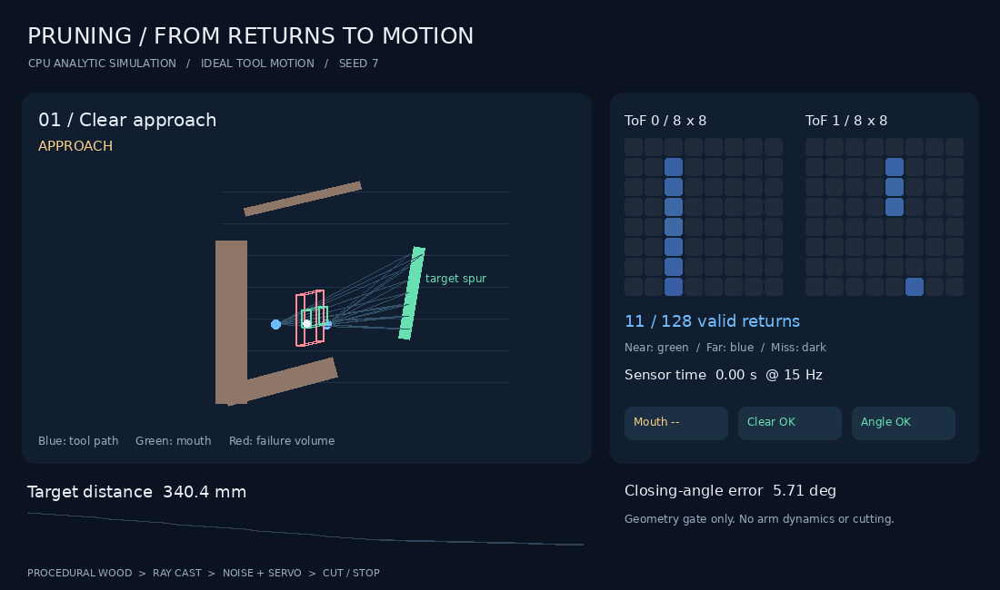
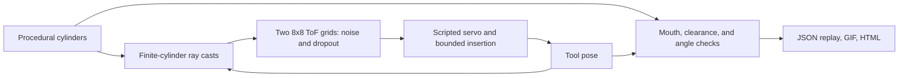

# Robotic pruning

Simulate robotic pruning with dual-ToF feedback, tool control, and collision checks.



18-second CPU simulation: approach a spur, lose sensor lock, then reject nearby
wood. The tool follows commands exactly; the final insertion uses a bounded
stroke and known geometry. No arm dynamics or physical cutting are simulated.
[Open the offline replay](docs/DEMO.md) to scrub sensor frames and inspect
[every measured pose and check](docs/demo/pruning_demo.json).

## Quickstart

Requires Git and Python 3.10+ with `venv`, on Linux or macOS. Four commands;
no GPU, Isaac installation, downloaded tree dataset, or robot meshes required.

```bash
git clone https://github.com/joses2017smjh/isaac-sim-pruning-workflow.git pruning
python3 -m venv pruning/.venv
pruning/.venv/bin/python -m pip install --extra-index-url https://download.pytorch.org/whl/cpu -e 'pruning/source/isaaclab_pruning[demo,dev]'
pruning/.venv/bin/python pruning/tools/run_pruning_demo.py --output-dir pruning/demo-output
```

Open `pruning/demo-output/pruning_demo.html` in your browser. It loads locally.
The command also writes the GIF, a PNG poster, and a JSON replay. Record one
18-second GIF loop, then spend 10 seconds scrubbing the failure episodes.
[Capture instructions](docs/DEMO.md) include the exact sequence.

Tests: from `pruning/`, run `.venv/bin/python -m pytest -q -m 'not isaacsim_ci'`.
The separate [Isaac/HPC path](docs/HPC.md) requires the pinned GPU stack and
generated assets. CI runs the CPU tests and publishes the demo as an artifact.

## Architecture



The [CPU demo](source/isaaclab_pruning/isaaclab_pruning/demo) reuses the
sensor, controller, and geometry modules. The
[Isaac environment](source/isaaclab_pruning/isaaclab_pruning/sim/pruning_env.py)
adds UR5e articulation, differential IK, live ray-casters, and PhysX contact.
It remains behind runtime checks; flow, learned depth, CuRobo execution, and
PPO training are unfinished. [Implementation gates](docs/ROADMAP.md).

## Results

| Check | Measured result | Scope |
|---|---|---|
| Clear approach, seed 7 | Cut geometry accepted after 42 frames; angle error 0.65° | CPU, ideal tool motion |
| Sensor blackout, seed 7 | Stopped after 20 frames; 0/128 returns on the final four frames | CPU failure case |
| Nearby wood, seed 7 | Cut rejected after 35 frames | CPU failure-zone check |
| Nominal range fusion | 6.08 → 5.49 mm RMSE on 651 shared valid samples | ToF versus fusion with synthetic metric estimates |
| Blackout range fusion | 8.15 → 9.57 mm RMSE across each output's available samples | Coverage differs; filling misses adds noisier estimates |
| [RTX depth check](docs/evidence/isaac_smoke_21077170.json) | Cube 1.5000 m; plane 2.0000 m; 100% finite | Isaac Sim 6.0, A40 |
| [Robot import](docs/evidence/urdf_import_21136450.json) | Six active UR joints; reviewed fixed transforms verified | Composed USD stage |
| [Isaac tool hold](docs/evidence/smoke_21186027.json) | 20.12 mm drift against a <5 mm limit | Both ToF grids finite; motion gate failed |
| CPU test suite | 133 passed; 1 simulator test deselected | Fresh Python 3.10 environment |

These are component checks and three deterministic scenarios, not a pruning
success-rate benchmark. The demo's final stroke can lose ToF overlap and uses
known geometry for its cut decision. No learned-policy, held-out orchard, or
hardware result is reported. [Full HPC outcomes](SLURM_JOBS.md).

## Stack

- Python, PyTorch, NumPy, PyYAML
- Pillow and Matplotlib fonts for demo rendering
- Isaac Sim 6.0.0.1, Isaac Lab 3.0.0b2, USD, Warp, PhysX
- Slurm, Apptainer, pytest, Ruff, GitHub Actions

Jose Sanchez · Oregon State University.
[Provenance and licensing](NOTICE.md) · [Reviewer gaps](docs/REVIEWER_NOTES.md)
