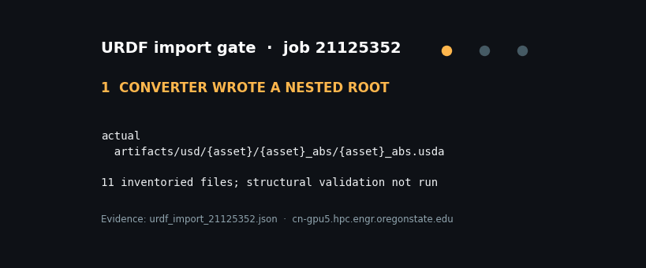
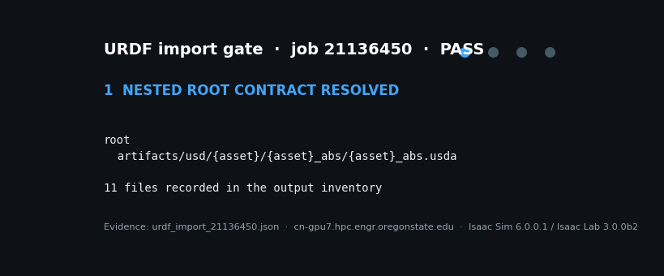

# Dormant-spur pruning in Isaac Sim 6.0

**Measured on this cluster, not a tutorial screenshot.**

Jose Sanchez — Oregon State University

[](docs/evidence/isaac_smoke_21077170.json)

Isaac Sim **5.1 RTX segfaults** here. **6.0 does not.** Cube planar-z is **1.5000 m**. Plane is **2.0000 m**. RGB std **38** — a bare cube with no material looked black; that was lighting, not a dead renderer.

```
150  A  flow 8×8
278  B  two VL53L8CX
 86  C  metric student   ⎤ same width — content differs
 86  D  fuse(ToF0+ToF1+C) ⎦
```


Cameras on the stage are not observations. BHL reported 9/9 ok at width **194 for every task**. This repo **asserts** A≠B≠C and `cfg.observation_space == obs.shape[-1]`.

The dual ToF path now uses two live Isaac Lab `MultiMeshRayCasterCamera`s: 8×8,
65° diagonal FOV, 15 Hz, 0.03–3.4 m. Flow and metric-student feeds remain
explicit placeholders, and wrist RGB remains disabled. The fresh robot import
passed. Two live-ToF environment attempts then failed during construction: the
second preserved the exact Lab-2 placeholder/Lab-3 global-path mismatch. That
path contract is fixed and retry `21153411` is queued. See the
[live job ledger](SLURM_JOBS.md) before treating an implementation checkbox as
cluster evidence.

## What you can see today

| Component | Demo | Evidence |
|---|---|---|
| RTX cube / plane |  | [job 21077170](docs/evidence/isaac_smoke_21077170.json) |
| Finite cylinders, not capsules |  | Envy `00000`–`00009` USDA |
| 100 Envy + 100 UFO | — | [200 USDA](docs/evidence/trees_converted_manifest.json) |
| Blender pose, trunk median | — | [0.00055 mm](docs/evidence/blender_trunk_mm_lpy_envy_00000.json) |
| `bark_brown_02` UsdPreviewSurface | — | tree + orchard `Looks/` materials |
| Wrist camera (RGB still off) | — | physical frame found; model/calibration open · [`close_lateral` is a sim candidate](docs/evidence/camera_offset_raycast.json) |
| Legacy cutter mouth / failure proxies |  | [fitted AABB](docs/evidence/cutter_boxes_fitted.json) · not current-hardware validation |
| D fuses **both** ToF + resampled metric |  | Seeded CPU contract demo—not a live rollout; native C is a second table |
| Import contract catches a false green |  | [job 21125352](docs/evidence/urdf_import_21125352.json): Slurm completed, application gate failed |
| Fresh UR5e + mock-pruner import |  | [job 21136450](docs/evidence/urdf_import_21136450.json): composed-stage PASS, six UR joints, no slider, reviewed transforms |
| Live dual-ToF smoke | Pending | Job `21153411` is queued; [job 21153271](docs/evidence/smoke_21153271.json) diagnosed and preserved the globally rooted prim-path failure |

v1 does not spawn the hardware slider. IK is **absolute 7-D pose** (`use_relative_mode: false`). Relative mode is 6-D; keeping 7 with relative on would fail `set_command`.

## Stack that actually runs

`bhl.sif` + `venv-isaac60` · Isaac Sim **6.0.0.1** · Lab **3.0.0b2** · `BHL_STACK=v60`

Not NVIDIA 5.x `create_empty.py`. Not V100 (no RT cores). How we got here: [`docs/ISAAC_STACK.md`](docs/ISAAC_STACK.md).

```bash
source /nfs/hpc/share/$USER/Humanoid_Lite/bhl-robustness-ladder/slurm/_env.sh
slurm_clean sbatch hpc/slurm/isaac_headless_smoke.sbatch   # Gate 0 (passed)
# env_smoke also requires the promoted PRUNING_ASSET_ID / USD / evidence paths;
# see docs/HPC.md. Current retry: 21153411 (pending at last reconciliation).
```

PPO is **refused** until both baselines have Isaac job logs.

```bash
python tools/train.py --variant B_tof --seed 0
# exits: missing baselines
```

## Reproduce the demos (no GPU)

```bash
python -m pip install -e "source/isaaclab_pruning[dev,demo]"
python -m pytest -q -m "not isaacsim_ci"
python tools/render_demos.py
# after a passing live smoke only:
python tools/render_demos.py --smoke-evidence docs/evidence/smoke_<jobid>.json
```

Control loop: DA2-ft once per episode (185 ms fp16 — not inside PPO). The
reviewed VL53L8CX firmware streams 8×8 at **15 Hz**; a faster controller would
reuse samples. Flow/student cadence still needs live implementation evidence.

Full gates: [`docs/ROADMAP.md`](docs/ROADMAP.md) · live scheduler audit:
[`SLURM_JOBS.md`](SLURM_JOBS.md) · hardware sources:
[`docs/ROBOT_SENSOR_SOURCES.md`](docs/ROBOT_SENSOR_SOURCES.md) · HPC:
[`docs/HPC.md`](docs/HPC.md)

Anchors: [spur-depth-service](https://github.com/joses2017smjh/spur-depth-service) · [bhl-robustness-ladder](https://github.com/joses2017smjh/bhl-robustness-ladder) · harness `5701a77` preserved in this fork (original upstream unavailable)
