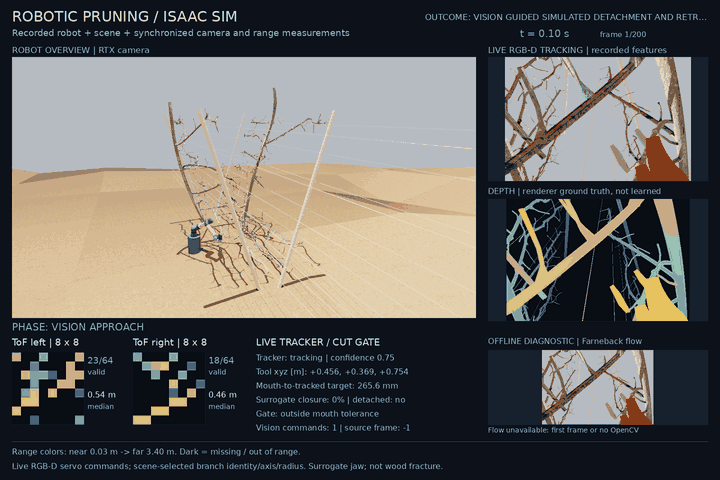
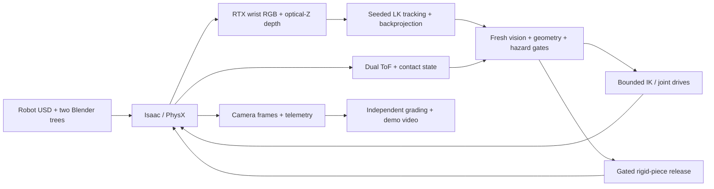

# Robotic pruning

Closed-loop RGB-D control, sensor gating and independent task grading for a simulated UR5e pruning workflow.

**[Open the replay studio](https://joses2017smjh.github.io/isaac-sim-pruning-workflow/)** — scrub three
recorded runs frame by frame: camera, tracker confidence and features, both 8x8 time-of-flight grids with
validity, gate states and proposed against applied commands. Every value is read from a capture file.

[](https://github.com/joses2017smjh/isaac-sim-pruning-workflow/releases/download/isaac-vision-2026-09-13/isaac_two_trees_vision_sequence.mp4)

[Watch the 20-second demo](https://github.com/joses2017smjh/isaac-sim-pruning-workflow/releases/download/isaac-vision-2026-09-13/isaac_two_trees_vision_sequence.mp4)
· [Wrist-camera video](https://github.com/joses2017smjh/isaac-sim-pruning-workflow/releases/download/isaac-vision-2026-09-13/isaac_two_trees_vision_sequence_wrist.mp4)
· [Measured results](docs/evidence/two_tree_summary_2026-09-14.json)
· [Capture guide](docs/ISAAC_RENDER.md)

## Problem

A pruning arm has to approach a thin branch from wrist RGB-D and dual ToF,
then release only when tracking and geometry still agree. Jaw occlusion can
wipe out image features at the worst moment. A finished recording is not a
finished cut.

## Solution

Isaac Sim 6.0 / Lab 3 drives the original UR5e and mock pruner among both
source Blender trees. Seeded pyramidal Lucas–Kanade tracking back-projects RTX
optical-Z depth into bounded Cartesian commands. Dual 8×8 ray-cast ToF,
contact, and geometry gates must pass before a visual-jaw surrogate releases
one rigid spur. An independent grader scores the saved capture; it does not
trust the renderer’s success label.

Branch identity, axis, and radius come from mesh metadata. Subsequent positions
come from image tracking and simulator depth, not learned recognition. This is
a discrete rigid-piece release, **not wood fracture**.

**Engineering contribution:** integrating the robot and orchard assets with
camera-based control, fresh-observation and geometry checks, recorded telemetry,
and a separate sequence grader. The [environment](source/isaaclab_pruning/isaaclab_pruning/sim/pruning_env.py),
[grader](tools/validate_vision_sequence.py) and [asset provenance](NOTICE.md)
make the implementation and its upstream dependencies inspectable.

## Result

Job `21328323` applies **68 vision commands**, releases one selected spur at
**7.8 s**, measures **809.49 mm of fall**, and returns within **0.001 mm** of
home. All **17 independent sequence checks** pass. That is one known target,
not pruning both trees or a measured success rate.

The contrasting [closure failure](https://github.com/joses2017smjh/isaac-sim-pruning-workflow/releases/download/isaac-vision-2026-09-13/isaac_two_trees_closure_failure.mp4)
preserves a stopped attempt:
tracking confidence falls below 0.15 at 7.7 seconds; motion stops without
release. [Failure GIF](docs/demo/isaac_two_trees_closure_failure.gif).
Tracking loss *after* a completed release is allowed during home-directed
retreat; the success dashboard preserves that state instead of hiding it.

The **20-second success video** includes approach, release at **7.8 seconds**,
the measured fall and the return. The wrist view shows the same sequence.

**Lighting pilot (array `21360571`, six sequences).** Raw and CLAHE contrast
normalization, each under source, morning and evening light, on that same spur.
All six pass 17/17 independent checks. **CLAHE is dropped**: it changed no task
outcome and no tracking continuity, so it fails the pre-registered comparison and
is recorded as a rejected diagnostic. The pilot did find a margin: under morning
light the raw tracker fell to **4 surviving features against its own floor of 4**,
completing the task with nothing to spare. Six trials on one target are a paired
pilot, not a success rate.
[Decision and table](docs/RESEARCH_EXPERIMENTS_2026-09-19.md#decision-on-the-clahe-candidate)
· [pilot results](docs/evidence/lighting_pilot_results_2026-09-23.json)
· [job ledger](SLURM_JOBS.md)

**Success-rate sweep (arrays `21400715` / `21400716`, 40 trials).** Twenty spurs
drawn with a fixed seed from 444 that pass the jaw-fit screen, each run under
source and morning light, registered before submission.
**0 of 40 completed (Wilson 95%: 0–8.8%).** The single success above does not
generalize. Every run that recorded was stopped by a gate: hazard contact (6),
invalid vision (6) or time-of-flight clearance (2); six more were refused before
motion because the canonical pose put the tree into the robot. Each target ended
the same way under both lights. **Half the trials measured nothing:** the ten
tree1 targets were outside the renderer's accepted candidates, an error in the
target register that is disclosed, kept in the denominator, and now caught on CPU
before submission. This sweep speaks for tree0 only.
[Protocol and result](docs/EVAL_PROTOCOL_2026-09-23.md#result--september-23-2026)
· [evidence](docs/evidence/eval_2026-09-23.json)
· [typical stop](docs/demo/eval_failure_hazard_contact.png)

**Learned depth across trees and lighting.** A separate question from the
controller, whose tracker is not learned. The Envy-trained metric-depth model
(DA2) run on Isaac frames of the original tree fails every pre-registered gate:
0 of 234 target frames within 20 mm, a systematic **+0.4 to +0.6 m**
overestimate. A pre-registered eight-tree matrix on Blender renders (4 Envy,
4 UFO, four lighting presets) then found: **evening light raises the error
6–8× in all 8 trees**; **UFO is consistently worse than Envy under every light**
(+5–9 cm in daylight, +54 cm at evening, no overlap between families), yet with
each frame's own offset removed UFO is no worse — the model reads UFO trees as
further away, not as a different shape. A six-view DINO refiner adds nothing at
2.2 s. All gates fail, as predicted before submission. Envy cannot be an
unseen-tree test, since every Envy tree was in the model's training or
validation split.
[Protocol and result](docs/EVAL_PROTOCOL_FAMILY_LIGHTING_2026-09-23.md#result--september-23-2026)
· [matrix evidence](docs/evidence/family_matrix_depth_2026-09-23.json)
· [Stage A](docs/evidence/stage_a_depth_2026-09-23.json)

## Quickstart

The CPU demo requires Git and Python 3.10+ with `venv` on Linux or macOS.
It reproduces approach, sensor blackout and blocked-cut geometry. It does
**not** render the Isaac video above. Four commands:

```bash
git clone --branch develop https://github.com/joses2017smjh/isaac-sim-pruning-workflow.git pruning
python3 -m venv pruning/.venv
pruning/.venv/bin/python -m pip install --extra-index-url https://download.pytorch.org/whl/cpu -e 'pruning/source/isaaclab_pruning[demo,dev,render]'
pruning/.venv/bin/python pruning/tools/run_pruning_demo.py --output-dir pruning/demo-output
```

Open `pruning/demo-output/pruning_demo.html`. It contains an 18-second GIF and
sensor-frame scrubber. [CPU capture instructions](docs/DEMO.md).
From `pruning/`, test with `.venv/bin/python -m pytest -q -m 'not isaacsim_ci'`.

The [Isaac path](docs/ISAAC_RENDER.md) requires the pinned GPU stack and external
robot/orchard assets. CI verifies the CPU path, not a clean-machine GPU installation.

## Architecture



[Environment](source/isaaclab_pruning/isaaclab_pruning/sim/pruning_env.py)
→ [capture](hpc/inner/render_pruning_workflow.py)
→ [sequence grader](tools/validate_vision_sequence.py)
→ [compositor](tools/compose_isaac_workflow.py).

The scene comes from `.blend` → USD, not PLY. Farneback flow is an offline
diagnostic. Same-depth feature maintenance runs only while tracking is valid;
new corners must pass the next frame's tracking gates.

## Evidence

| Check | Result | Limit |
|---|---|---|
| Two-tree sequence, `21328323` | 200 frames / 20 s; 68 applied vision commands; 262.94 mm tool displacement | One selected spur; visual jaw proxy, no physical blade actuation |
| Independent task grade | 17/17 checks; release at 7.8 s; 809.49 mm post-release drop; <0.001 mm final home error | Capture-rate evidence, not continuous contact safety |
| Two-tree tracking failure, `21316823` | Stops at 6.3 s after 63 commands | No closure, release or return |
| Two-tree closure failure, `21317409` | Confidence 0.14165 < 0.15 at 7.7 s; closure 2/3 | No release; failed recording preserved |
| Earlier one-tree approach, `21247873` | 60 commands / 6 s; 230.08 mm movement | Ended 35.01 mm from target at the mouth; no release |
| Earlier control smoke | 0.360 mm final error for a 5 mm command | Six-step hold; earlier floor-contact fixture drifted 20.12 mm and failed |
| CPU clear / blackout / blocked geometry | Accepted at 42 frames / stopped at 20 / rejected at 35 | Ideal tool motion |
| CPU range fusion | Nominal RMSE 6.08 → 5.49 mm; blackout 8.15 → 9.57 mm | Synthetic metric estimates; blackout coverage differs |
| Local CPU suite, September 23 | Tracked scope: 547 passed; 9 skipped; 1 simulator test deselected | The 9 skips need USD, absent from the CPU interpreter |
| ROS 2 SIL parity, `21328323` | 199/199 recorded decision states reproduced; command deltas within 2 mm (median 0.07 mm) | Replay of one capture; software-in-the-loop, no hardware ([notes](docs/ROS2_SIL.md)) |
| ROS 2 negative controls | RGB blackout and depth dropout each hold 39/39 frames | Neither ever authorizes approach or release |
| GitHub CI, checkpoint `68e37c5` | 451 passed; 9 skipped; 1 deselected | Clean runner without external runtime assets |

[Aggregate evidence](docs/evidence/two_tree_summary_2026-09-14.json)
· [Success and failure videos](https://github.com/joses2017smjh/isaac-sim-pruning-workflow/releases/tag/isaac-vision-2026-09-13)
· [HPC ledger](SLURM_JOBS.md).

RTX path tracing and OptiX denoising replace the older grainy capture settings.
No compositor median filter is applied. Ground relief is visual over a flat
collider; material/lighting conversion is not Blender Cycles parity.
[Morning/evening presets](docs/ISAAC_RENDER.md#daylight-variants) change the
simulated sun, not the source scene.

The six-run lighting/tracker pilot is summarized under [Result](#result) and
decided in full in the [protocol](docs/RESEARCH_EXPERIMENTS_2026-09-19.md#decision-on-the-clahe-candidate).
All six use the same original `tree0` spur and RTX depth, so neither a CLAHE
advantage nor population robustness is established. Two earlier full daylight
runs also pass and are listed separately, outside the pre-registered array.
[Earlier audit](docs/evidence/repository_audit_2026-09-20.json) · [job ledger](SLURM_JOBS.md).

The [September 20 research audit](docs/RESEARCH_AUDIT_2026-09-20.md) verifies
100 Envy + 100 UFO assets and lists the pending checkpoint-provenance, learned-depth,
paired-lighting and eight-clip work. None of those new experiments is queued.
Remaining: a controller that completes more than the one known spur (the
registered sweep passed 0 of 40); a tree1 evaluation under a new registration;
ROS 2 hardware-in-the-loop, which needs the physical rig; an executed CuRobo
plan, blocked on the pinned stack ([probe](docs/evidence/curobo_feasibility_2026-09-23.json));
learned perception; PPO baselines; physical camera calibration; and actuated
blades and cutting mechanics.
The [replay studio](https://joses2017smjh.github.io/isaac-sim-pruning-workflow/)
plays recorded runs only; there is no trained policy to run in the browser.
[ROS 2 software-in-the-loop](docs/ROS2_SIL.md) replays recorded sensors through
the same controller.
[Implementation gates](docs/ROADMAP.md) · [Reviewer gaps](docs/REVIEWER_NOTES.md).

## Stack

- Python, PyTorch, NumPy, PyYAML
- Isaac Sim 6.0.0.1, Isaac Lab 3.0.0b2, USD, Warp, PhysX
- Blender 4.2.19 LTS, UsdPreviewSurface
- OpenCV, Pillow, Matplotlib, ffmpeg
- Slurm, Apptainer, pytest, Ruff, GitHub Actions

Jose Sanchez · Oregon State University · [Provenance and licensing](NOTICE.md)

## Authorized research execution (2026-09-20)

Implementation and jobs are now in progress; the preceding audit-only snapshot is historical. Frozen DA2 offline evaluation job **21370005** submitted, no dependencies. The one-frame CPU accuracy gate failed; learned control remains conditional. Checkpoint-specific leakage corrections, current job/result states and storage are tracked in the [execution record](docs/RESEARCH_EXECUTION_2026-09-20.md) and `docs/evidence/research_execution_2026-09-20.json`.
