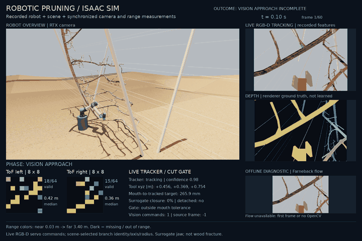
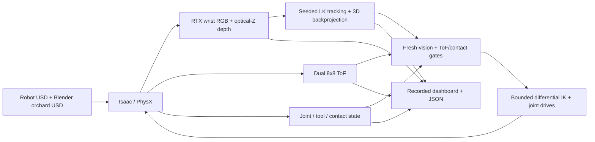

# Robotic pruning

Simulate vision-guided UR5e approach in a textured Blender orchard with dual-ToF sensing.

[](https://github.com/joses2017smjh/isaac-sim-pruning-workflow/releases/download/isaac-vision-2026-09-13/isaac_blender_live_approach.mp4)

[Full-size dashboard](docs/demo/isaac_blender_live_approach.png)
· [Download videos](https://github.com/joses2017smjh/isaac-sim-pruning-workflow/releases/tag/isaac-vision-2026-09-13)
· [Recorded evidence](docs/evidence/render_21247873.json)
· [Failures and reproduction](docs/ISAAC_RENDER.md)

This six-second clip is the earlier one-tree approach. The current renderer
loads both distinct original Blender trees, with both in collision and ToF
queries. [Two-tree failure recording](docs/demo/isaac_two_trees_tracking_failure.gif)
completed in `21316823`. Camera-layout retry `21317169` is running.

Actual Isaac/PhysX motion in the original textured orchard: **60 applied
vision commands, 230.08 mm tool displacement, six seconds recorded**. The
original UR5e and mock pruner use wrist RGB-D tracking and a live ToF guard.
The dashboard shows tracked image features, simulator depth, two 8×8 ToF
grids, measured tool state, and the cut gate. Farneback flow is a separate
offline diagnostic, not a controller input.

The run ends with the tool mouth **35.01 mm from the tracked target**.
Its outcome is `vision_approach_incomplete`: no closure, detachment, or retreat.
Show one six-second loop, then pause at three seconds to explain the sensors.
The [capture guide](docs/ISAAC_RENDER.md) records all cameras and telemetry;
the MP4 preserves all 60 frames at 10 fps.

Earlier recordings: [14-second procedural inspection and retreat](https://github.com/joses2017smjh/isaac-sim-pruning-workflow/releases/download/isaac-inspection-2026-09-07/isaac_workflow.mp4)
· [Occluded-target failure](docs/demo/isaac_textured_scene_failed_vision.gif)
· [Path-traced quality probe](docs/demo/isaac_quality_probe_unfiltered.gif).

The Blender path exports the existing `.blend` scene to USD with UVs and image
textures; it does not import `.ply` files. Branch identity, axis, radius, and
the initial target pixel come from scene metadata. Tracking supplies subsequent
position updates; this is classical vision, not learned recognition or depth.

## Quickstart

The portable CPU demo runs without Isaac, a GPU, robot assets, or a tree dataset.
It reproduces approach, sensor-blackout, and blocked-cut geometry scenarios;
it does **not** produce the Isaac robot video above. Requires Git and Python
3.10+ with `venv` on Linux or macOS. Four commands:

```bash
git clone https://github.com/joses2017smjh/isaac-sim-pruning-workflow.git pruning
python3 -m venv pruning/.venv
pruning/.venv/bin/python -m pip install --extra-index-url https://download.pytorch.org/whl/cpu -e 'pruning/source/isaaclab_pruning[demo,dev,render]'
pruning/.venv/bin/python pruning/tools/run_pruning_demo.py --output-dir pruning/demo-output
```

Open `pruning/demo-output/pruning_demo.html` locally. It includes an 18-second
GIF and a sensor-frame scrubber. [CPU capture instructions](docs/DEMO.md).
From `pruning/`, test with `.venv/bin/python -m pytest -q -m 'not isaacsim_ci'`.

To render the robot, follow the [Isaac recording guide](docs/ISAAC_RENDER.md).
That path requires the pinned GPU/container stack and externally generated
robot USD. CI tests the CPU path, not the GPU installation.

## Architecture

Recorded Blender/live-vision path:



[Environment](source/isaaclab_pruning/isaaclab_pruning/sim/pruning_env.py)
→ [capture](hpc/inner/render_pruning_workflow.py)
→ [video compositor](tools/compose_isaac_workflow.py).
The [CPU demo](source/isaaclab_pruning/isaaclab_pruning/demo) instead uses
analytic finite-cylinder ray casts and ideal tool motion.

The Blender mode connects consecutive RTX RGB/depth observations to a
[seeded LK tracker](source/isaaclab_pruning/isaaclab_pruning/perception/visual_servo.py)
and [causal controller](source/isaaclab_pruning/isaaclab_pruning/sim/vision_demo_controller.py).
Only the initial pixel and branch identity/axis/radius come from scene metadata;
tracking loss holds motion without automatic reseeding. Its cutting model is a
gated visual jaw proxy and discrete rigid-piece release. It does not model
actuated CAD blades, cutting forces, or wood fracture.

## Results

| Check | Measured result | Scope |
|---|---|---|
| [Blender/live RGB-D approach](docs/evidence/render_21247873.json) | 60 applied vision commands; 230.08 mm displacement; final tracked-mouth distance 35.01 mm | 60 frames / 6 seconds; all ten capture checks pass; no closure, detachment, or retreat |
| Blender dual-ToF coverage | 33.54% / 33.28% valid rays; both streams changed | Noise disabled; misses stay missing |
| [Isaac inspection](docs/evidence/render_21208215.json) | 247.37 mm displacement; 96.07 mm closest standoff; 1.65 mm return error | One scripted 14-second episode; no cut |
| Inspection dual-ToF coverage | 40.01% / 42.31% valid rays; median-range spans 384.84 / 321.47 mm | Moving procedural tree view; noise disabled |
| [Tool control smoke](docs/evidence/smoke_21208215.json) | 0 mm hold drift at recorded precision; 0.360 mm final error for a 5 mm command | Six-step hold, elevated mount; 20 contact bodies instrumented |
| [Earlier control failure](docs/evidence/smoke_21201622.json) | 20.12 mm hold drift; mock pruner pressed against floor at roughly 180 N | Original floor-level fixture; failed the unchanged 5 mm limit |
| [Earlier rendered approach](docs/evidence/render_21201622.json) | 140 frames captured, but approach failed | Rendering passed; task did not |
| Path-traced quality probe, job `21222688` | 30 frames / 3 seconds; 96.49 mm standoff; 16.08 mm return error | Procedural fixture; visual comparison, not a controlled performance benchmark |
| Blender/live-vision attempt, job `21222710` | 60 frames / 6 seconds; zero vision-driven approach commands | `vision_stopped_failure`; no closure, detachment, or observed retreat |
| CPU clear approach, seed 7 | Geometry accepted after 42 frames; 0.65° angle error | Ideal tool motion, not physical cutting |
| CPU sensor blackout / nearby wood | Stopped at 20 frames / rejected at 35 frames | Failure scenarios |
| CPU range fusion | Nominal RMSE 6.08 → 5.49 mm; blackout 8.15 → 9.57 mm | Synthetic metric estimates; blackout coverage differs |
| CPU test suite | 468 passed; 1 simulator test deselected | Local Python 3.12 with generated assets; includes two-tree export, camera geometry and independent sequence grading; GPU integration is a separate gate |
| GitHub CI, commit `a121afe` | 444 passed; 8 skipped; 1 deselected | Clean runner without the external GPU/runtime assets; previous checkpoint |

Evidence preserves failed runs, source hashes, runtime versions, and sensor
misses. Contact instrumentation and one no-contact episode do not prove
collision avoidance. The Blender recording uses RTX path tracing and OptiX
denoising, without a compositor median filter. The older procedural recording
uses a labelled display-only filter. [HPC ledger](SLURM_JOBS.md).

The Blender ground retains visual relief over a flat ground collider. Material
conversion and recorded lighting/UV overrides do not reproduce Cycles exactly.
Full-duration retry `21300015` lost tracking at 5.5 seconds: three image features
passed the round-trip check, below the unchanged minimum four. The controller
latched a stop, without closure or release. The job was cancelled after 10m53s;
71 partial frames and its incomplete report remain preserved. Earlier retry
`21298152` was cancelled for capture throughput. CPU replay reproduced the
tracking failure; two-tree run `21316823` subsequently stopped at 6.3 seconds
with 63 applied commands. Its full 20-second recording is preserved.

The two-tree export preserves original `tree0` and `tree1` meshes and relative
placement; it does not duplicate a tree. Job `21317169` tests a fixed camera
aligned with the jaw opening after inspection of the prior occluded features.
The four-inlier tracking minimum and cut thresholds remain unchanged.
[Preserved partial tracking-stop GIF](docs/demo/isaac_blender_tracking_stop.gif).

Remaining demo gate: complete approach, gated surrogate release, measured piece
drop, and retreat. Separate research work: learned recognition/depth, CuRobo
execution, PPO training, physical camera calibration, actuated blade CAD, and
wood-fracture mechanics. The current jaw is a visual surrogate, not a cutting tool.
[Implementation gates](docs/ROADMAP.md) · [Reviewer gaps](docs/REVIEWER_NOTES.md).

## Stack

- Python, PyTorch, NumPy, PyYAML
- Isaac Sim 6.0.0.1, Isaac Lab 3.0.0b2, USD, Warp, PhysX
- Blender 4.2.19 LTS, UsdPreviewSurface
- OpenCV, Pillow, Matplotlib, ffmpeg
- Slurm, Apptainer, pytest, Ruff, GitHub Actions

Jose Sanchez · Oregon State University · [Provenance and licensing](NOTICE.md)
