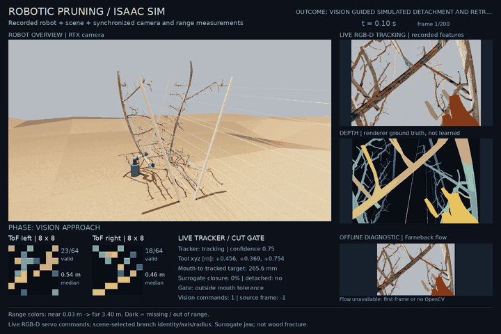
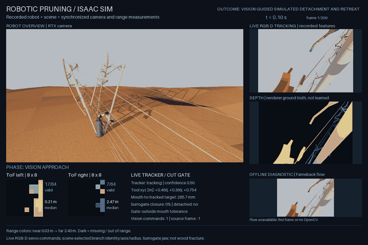

# Vision-Guided Pruning in Isaac Sim

Closed-loop RGB-D control for a simulated UR5e: track a selected spur, gate motion and release with dual ToF and contact checks, then independently grade the recorded sequence.

[](https://github.com/joses2017smjh/isaac-sim-pruning-workflow/releases/download/isaac-vision-2026-09-13/isaac_two_trees_vision_sequence.mp4)

*Selected 20-second simulation: one known target, 17/17 sequence checks. Release is a discrete rigid-piece surrogate; the jaws do not model wood fracture.*

[Replay studio](https://joses2017smjh.github.io/isaac-sim-pruning-workflow/) · [Case study](https://jose-sanchez-portfolio-com.vercel.app/projects/isaac-pruning-workflow/) · [Wrist view](https://github.com/joses2017smjh/isaac-sim-pruning-workflow/releases/download/isaac-vision-2026-09-13/isaac_two_trees_vision_sequence_wrist.mp4)

## Problem and contribution

Thin branches are hard to track near a closing tool: the jaw can occlude the target, and its low-sun shadow can trigger an appearance gate even when the branch stays still. I built the live RGB-D controller, sensor and release gates, captured telemetry, independent sequence grader, and controlled failure studies.

Robot and orchard assets are pinned upstream inputs. Initial branch identity, axis, and radius come from mesh metadata; subsequent positions use classical Lucas–Kanade tracking and simulator optical-Z depth. This is not learned branch recognition or a physical pruning result. [Asset provenance](NOTICE.md).

## Results and limits

- **Selected baseline sequence:** 68 vision commands, release at 7.8 s, 809.49 mm fall, and <0.001 mm final home error; 17/17 independent checks. [Evidence](docs/evidence/two_tree_summary_2026-09-14.json).
- **Registered population study:** 0/40 planned trials completed; 20 trials had invalid tree1 registrations. The remaining tree0 trials stopped or were refused by vision, contact, ToF, or layout checks. A later valid seven-target tree1 study passed 2/7; a separate seeded 30-target draw passed 1/30. These populations are not pooled. [Original sweep](docs/EVAL_PROTOCOL_2026-09-23.md) · [Listed targets](docs/EVAL_PROTOCOL_STRATEGIES_2026-09-23.md) · [Seeded population](docs/EVAL_PROTOCOL_PERCEPTION_2026-09-26.md).
- **October 2, depth-aware appearance:** target 15004 completed 4/4 targeted morning/evening trials with 17/17 checks. Genuine jaw and wire occlusions remained rejected; live and offline decisions agreed across all 10 runs. Depth is simulator ground truth. [Protocol](docs/EVAL_PROTOCOL_DEPTH_APPEARANCE_CLOSED_LOOP_2026-10-01.md) · [Receipt](docs/evidence/depth_loop_verdicts_2026-10-02.json).
- **October 2, jaw-aware closure:** a known-map plan, jaw self-mask, and closure hold completed contact target 530 in 3/3 repeats. This variant waives freshness and frame-reuse checks on held frames and uses exact simulated jaw poses; it is reported separately from unchanged-gate results. [Protocol](docs/EVAL_PROTOCOL_JAW_IN_VIEW_2026-10-01.md) · [Receipt](docs/evidence/jaw_in_view_verdicts_2026-10-02.json).
- **October 4, agreement arm:** evening target 14944, which still stopped under the depth-aware check, completed 4/4 trials with 17/17 checks. Once the depth test accepted the shadow event, the depth-agreement fraction replaced the collapsed appearance score in the confidence gate. Jaw and wire occlusions still stopped, and live and offline decisions agreed across all 6 runs. This variant changes the confidence gate's input on accepted frames and is reported separately. Depth is simulator ground truth. [Protocol](docs/EVAL_PROTOCOL_AGREEMENT_ARM_CLOSED_LOOP_2026-10-03.md) · [Receipt](docs/evidence/agreement_loop_verdicts_2026-10-04.json) · [Pass (GIF)](docs/demo/isaac_tree1_v14944_evening_agreement_pass.gif) · [Earlier stop, same target and light (GIF)](docs/demo/isaac_tree1_v14944_evening_vision_invalid.gif).
- **ROS 2 software-in-the-loop:** 199/199 recorded decision states reproduced; maximum command delta 1.995 mm. A C++17 ToF-deprojection port is checked against Python on 232 recorded zones at 1e-9 m tolerance. Recorded simulation replay, not hardware-in-the-loop. [Method and evidence](docs/ROS2_SIL.md).

These are targeted diagnostics and narrow populations. They establish inspectable simulator behavior, not orchard-wide reliability, continuous contact safety, or deployed hardware performance.

## Latest visual comparison

[](docs/EVAL_PROTOCOL_DEPTH_APPEARANCE_CLOSED_LOOP_2026-10-01.md)

*Same target and lighting as the [earlier appearance-stop recording](docs/demo/isaac_tree1_v15004_evening_appearance_stop.gif). The depth check accepts the shadow event; real occlusion controls still stop. This is one of four targeted passes.*

## How it works

Wrist RGB-D → seeded pyramidal LK tracking and backprojection → bounded Cartesian commands → IK / joint drives. Dual 8×8 ray-cast ToF, contact, freshness, and geometric gates condition approach and surrogate release. Camera frames and telemetry feed a separate grader that checks ordering, causal commands, closure, piece motion, retreat, and return.

[Environment](source/isaaclab_pruning/isaaclab_pruning/sim/pruning_env.py) · [Controller](source/isaaclab_pruning/isaaclab_pruning/sim/vision_demo_controller.py) · [Capture](hpc/inner/render_pruning_workflow.py) · [Independent grader](tools/validate_vision_sequence.py) · [Depth check](source/isaaclab_pruning/isaaclab_pruning/perception/depth_appearance.py) · [Jaw model](source/isaaclab_pruning/isaaclab_pruning/perception/jaw_self_mask.py).

## Engineering decisions and studies

- **Keep failed attempts:** tracking and closure failures preserve their stop reasons and raw telemetry; a renderer's success label cannot substitute for the grader.
- **Use depth to test surface consistency:** distinguish lighting changes from displaced surfaces while retaining correlation and jaw-occlusion checks. This currently depends on privileged simulator depth.
- **Separate variants:** known-map plans and closure holds change available information and gate behavior. Their passes are never added to baseline counts.
- **Test the depth model independently:** rendered-lighting training reduced evening target error from 0.88 to 0.05 m on Envy validation trees and 1.44 to 0.09 m on unseen UFO trees. Isaac wrist-camera error remained >0.5 m. [Lighting study](docs/EVAL_PROTOCOL_LIGHTING_TRAINING_2026-09-27.md). A [renderer control](docs/EVAL_PROTOCOL_RENDER_GAP_2026-09-30.md) showed that the original source-light matrix overstated accuracy; learned depth does not drive the live controller.

## Run locally

CPU demo: Git, Python 3.10+ with `venv`, Linux or macOS. It uses ideal tool motion and synthetic sensors; it does not render the Isaac footage.

```bash
git clone --branch develop https://github.com/joses2017smjh/isaac-sim-pruning-workflow.git pruning
python3 -m venv pruning/.venv
pruning/.venv/bin/python -m pip install --extra-index-url https://download.pytorch.org/whl/cpu -e 'pruning/source/isaaclab_pruning[demo,dev,render]'
pruning/.venv/bin/python pruning/tools/run_pruning_demo.py --output-dir pruning/demo-output
```

Open `pruning/demo-output/pruning_demo.html` for the demo and sensor scrubber. From `pruning/`, run:

```bash
.venv/bin/python -m pytest -q -m 'not isaacsim_ci'
```

[CPU instructions](docs/DEMO.md) · [CI configuration](.github/workflows/foundation.yml). Isaac captures require the pinned GPU stack and external robot/orchard assets: [capture guide](docs/ISAAC_RENDER.md), [stack](docs/ISAAC_STACK.md), and [HPC operations](docs/HPC.md). CPU CI does not certify a fresh GPU installation.

## Stack and next work

Python · OpenCV · NumPy · PyTorch for offline depth studies · Isaac Sim 6.0.0.1 · Isaac Lab 3.0.0b2 · USD / PhysX · Blender · ROS 2 Humble · C++17 · Slurm / Apptainer · pytest / GitHub Actions.

Next: evaluate these variants on newly registered targets, improve layout and collision planning, and validate sensor calibration and gate assumptions on a physical rig. Blade actuation and cutting mechanics remain outside the demonstrated system. [Current work](docs/PENDING.md).

Jose Sanchez · [Portfolio](https://jose-sanchez-portfolio-com.vercel.app/) · [GitHub](https://github.com/joses2017smjh)
