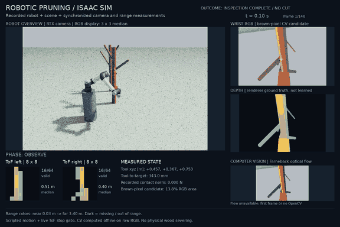
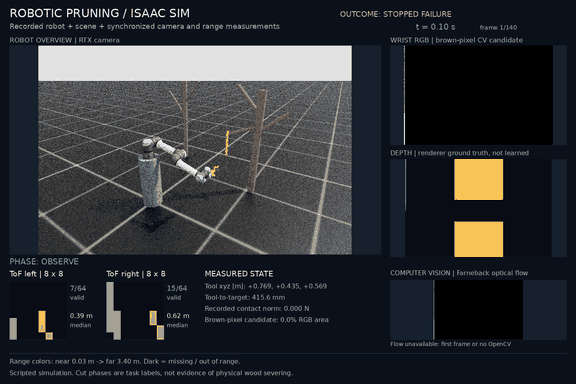

# Real Isaac robot recording

This path renders the imported UR5e and mock pruner with PhysX motion, RTX
cameras, two ToF sensors, and contact data. The published inspection uses a
procedural fixture. A separate Blender-scene/live-vision integration has now
rendered, but its first recorded task failed. Neither path requires a trained
policy or uses the analytic CPU demo's generated camera images.

## Where the scene and tree come from

Neither recording path loads Blender `.ply` files.

- **Published inspection (`21208215`) and quality probe (`21222688`):**
  [`RenderEnv._spawn_task_geometry`](../hpc/inner/render_pruning_workflow.py)
  authors finite-cylinder trees, target spur, pedestal, and ground directly as
  USD geometry. They have simple materials, not the orchard's bark/soil maps,
  posts, wires, or Blender lighting. Cleaner rendering does not add those assets.
- **Experimental Blender integration (`21222710`):**
  [`export_blender_orchard.py`](../tools/export_blender_orchard.py) reads the
  existing `Computer_Vision/orchard_template.blend` with Blender 4.2.19 LTS and
  exports `environment.usdc`, `tree0.usdc`, UVs, and six bark/soil image maps.
  [`blender_demo_scene.py`](../source/isaaclab_pruning/isaaclab_pruning/sim/blender_demo_scene.py)
  references those assets into Isaac, adds collision geometry, and selects an
  existing spur component. The source `.blend` is not modified. Its recorded
  SHA-256 begins `88352362755f4280`; the full export manifest and hashes are at
  `artifacts/blender_scene/orchard_v1/manifest.json`.

The exported posts and wires use the source's solid Principled materials, not
image textures. Preview Surface conversion does not reproduce arbitrary Cycles
nodes, displacement, or the original procedural sky. The export includes the
Sun; the first Isaac attempt also used a constant dome fill. Ground relief is
visual; a flat plane remains the ground collider. This is not yet appearance or
physics parity with Blender.

The repository has a separate dataset path:
Blender/L-Py `cylinder_data` JSON (or a full world-coordinate sidecar) →
[cylinder loader](../source/isaaclab_pruning/isaaclab_pruning/geometry/cylinders.py) →
[USD authoring](../source/isaaclab_pruning/isaaclab_pruning/usd/cylinders.py).
The [conversion manifest](evidence/trees_converted_manifest.json) records
100 Envy and 100 UFO trees, but those assets were **not loaded by job `21208215`**.
That conversion reconstructs finite cylinders from metadata; it is not a PLY
mesh import and does not establish identical Blender appearance or materials.

The original meshes now load. Collision-free robot placement, an unobstructed
target view, successful live approach, and gated detachment still require a
passing recording. A component selected from topology is not automatically a
safe cut site and is not learned branch recognition.

## Why the published video was grainy

The old capture used a real-time quality preset with DLSS/DL denoising requested;
its logs record failed NGX initialization. Dense speckle is already present in
the raw PNGs, before GIF compression or the compositor's optional median filter.
The 960×640 overview and size-limited GIF further limit presentation detail.

Quality probe `21222688` on an A40 recorded **30 frames / 3 seconds at 10 fps**.
Its raw overview is 1280×720; wrist RGB/depth remain 480×320 so the camera
intrinsics stay consistent. Path tracing and OptiX color denoising produced
visibly smoother robot, tree, and ground images, including the final frame.
The compositor applied no median filter to this probe. OptiX denoising still
occurs inside RTX; “unfiltered” in the artifact name means no compositor filter.

The requested/read-back settings were 32 samples per tick, 64 total samples,
four bounces, and four Kit updates per frozen physical pose. These are settings,
not a measured sample-count or fidelity benchmark. Readback initially matched,
but after warmup and at completion `/rtx/post/aa/op` was `1` instead of requested
`0`; that mismatch remains in the report. NGX errors also remain in the log.
The capture checks confirm the extra rendering updates did not advance physics.

The [clean-render GIF](demo/isaac_quality_probe_unfiltered.gif) and
[Blender failure GIF](demo/isaac_textured_scene_failed_vision.gif) are tracked
with their PNG posters and JSON telemetry. Full MP4s remain local; these new
clips are not release assets yet.

Local comparison artifacts:

| Capture | Video/poster/GIF filename stem | Recorded outcome |
|---|---|---|
| New quality probe | `artifacts/isaac_render/job_21222688/media/isaac_quality_probe_unfiltered` | `approach_inspect_retreat_no_cut` |
| Previous capture, without compositor filtering | `artifacts/isaac_render/job_21208215/media_unfiltered_comparison/isaac_previous_unfiltered` | `approach_inspect_retreat_no_cut` |

Each stem has `.mp4`, `.png`, `.gif`, and `.json` outputs. Use the MP4 for every
frame. The 3-second probe reaches 96.49 mm standoff but returns 16.08 mm from its
starting pose, versus 1.65 mm in the earlier 14-second recording. Its shorter
schedule and different GPU/resolution make this a visual comparison, not a
controlled robot-performance benchmark. It still uses the plain procedural scene.

## First textured Blender recording: stopped failure

Job `21222710` captured **60 frames / 6 seconds** with the original tree mesh,
bark textures, posts, and wires. Its report says `rendering_ok: true`, `ok: false`,
and `task_outcome: vision_stopped_failure`. This is not a successful pruning demo.

The robot/scene placement produced contact and an obstructed wrist view. The
selected center pixel saw orange tool housing at **37.24 mm** optical depth,
not the selected branch. Tracking initialized 12 image features, then rejected
the very first update: only two passed the default LK strength gate, below the
required four. A CPU replay of the identical saved warmup image reproduces that
failure exactly. RGB and stored grayscale do not share memory; annotator-buffer
aliasing is not required to explain the failure. Relative corner selection can
accept weak image features that LK's absolute strength threshold rejects.
Thresholds remain unchanged; an occluded tool pixel must not become a cut target.

The controller issued **zero vision-driven approach commands**. Closure stayed
at zero, no detachment event occurred, retreat was not observed, and the
`both_tof_live` check failed. The robot's measured displacement during this
contact-constrained stop is not evidence of successful visual servoing.

Local video/poster/GIF/evidence stem:
`artifacts/isaac_render/job_21222710/media/isaac_textured_scene_failed_vision`.
The source report, raw cameras, and arrays remain under that job directory.
Its dashboard shows recorded live-tracker failures and cut gates; the separate
Farneback panel is still explicitly an offline diagnostic.

The next revision changes scene placement and the exterior camera mount,
checks seed depth against the selected surface, hides the flat collider's
visual plane, adjusts the exported ground map to meter-scale repeats, and
changes the exported Sun intensity. Those presentation overrides are recorded
separately from the original export and do not establish Blender lighting parity.
They are not validated by either recording above and are not a released success.

The 90° layout retry `21224517` was rejected before recording by the 5 N
startup contact gate (34,443.24 N measured). The 180° retry `21227646` cleared
startup contact but failed because a NumPy PhysX tensor frontend cannot read
the GPU pipeline. The implementation now uses Torch and copies measured poses
to CPU explicitly. Both failure reports are preserved in
[the job ledger](../SLURM_JOBS.md).

The next run selects source spur `8235` at orchard yaw 150°. The new code
distinguishes proposed and physically applied vision commands, checks fresh
ToF before each possible detachment, and computes return error against the
measured pre-command home pose. Its GPU outcome must still be checked.

## Completed inspection recording

[](https://github.com/joses2017smjh/isaac-sim-pruning-workflow/releases/download/isaac-inspection-2026-09-07/isaac_workflow.mp4)

Job `21208215` completed on RTX 8000 node `cn-gpu6` in 2m44s. It recorded
140 frames at 10 fps: **14 seconds** of physically stepped robot motion.
The original UR5e and mock pruner work; no substitute robot was needed.

Tool-to-target distance went from 342.98 mm to 96.07 mm and back to 343.84 mm.
Maximum displacement was 247.37 mm; return error was 1.65 mm. The report records
`approach_inspect_retreat_no_cut`, with all ten capture checks passing.
Both ToF streams changed; individual rays were valid 40.01% / 42.31% of the time.
Missing rays are displayed as missing, not filled with invented measurements.

[Download the MP4](https://github.com/joses2017smjh/isaac-sim-pruning-workflow/releases/download/isaac-inspection-2026-09-07/isaac_workflow.mp4)
or [open the 1440×960 poster](demo/isaac_workflow.png).
For a presentation, play one **14-second** loop, then pause at **7 seconds**:
overview on the left, wrist RGB/depth on the right, ToF/state/flow below.
The GIF uniformly samples the entire sequence to stay below 1.9 MB; use the
MP4 for all frames. RGB display has a labelled 3×3 median filter to reduce RTX
speckle. Raw camera files, CV inputs, depth, and sensor metrics are unchanged.

Tracked evidence: [render](evidence/render_21208215.json),
[stack/source fingerprints](evidence/render_preflight_21208215.json),
[control smoke](evidence/smoke_21208215.json), and
[media provenance and frame metrics](demo/isaac_workflow.json).
The complete local capture is `artifacts/isaac_render/job_21208215/`;
the local MP4 is `artifacts/isaac_render/job_21208215/media/isaac_workflow.mp4`.

The smoke also passed: six-step hold drift was zero at recorded precision,
and a 5 mm command ended 0.360 mm from its target. Each ToF grid had 64 shared
valid pixels for that controlled-motion comparison. All 20 rigid bodies are
instrumented; the inspection itself recorded no contact. This is not a
long-duration stability test or proof of collision avoidance.

## Preserved earlier outcome: control failure



Job `21201622` recorded 140 frames at 10 fps: 14 seconds of robot motion.
Rendering and both ToF streams passed their artifact checks, but the robot
did not approach the target. The wrist camera was mostly obstructed and the
raw rendering was noisy. The visible `STOPPED FAILURE` label is intentional.
The GIF samples the full timeline; the full-resolution MP4 keeps all frames.

[Render evidence](evidence/render_21201622.json) and
[runtime/source fingerprints](evidence/render_preflight_21201622.json) are tracked.
Full local capture: `artifacts/isaac_render/job_21201622/`.
Full video: `artifacts/isaac_render/job_21201622/media/isaac_workflow_stopped_failure.mp4`,
also available as a [release download](https://github.com/joses2017smjh/isaac-sim-pruning-workflow/releases/download/isaac-inspection-2026-09-07/isaac_workflow_stopped_failure.mp4).
MP4s are release assets; large recordings and raw sensor arrays stay outside Git.

The recorder later corrected stopped-frame tracking-error telemetry to compare
against the command actually held, not the continuing scheduled trajectory.
Historical reports are unchanged. Do not use that old stopped-frame field as
a controller accuracy metric; the completed inspection did not enter a stop.

The same allocation exposed the original hold failure as contact-constrained:
the mock-pruner body pressed against the floor with roughly 180 N upward force.
Both tool-pose calculations agreed. The successful smoke elevates the robot
mount and its dedicated sensor target by 0.70 m, retaining the 5 mm hold limit.
The controller also uses bounded SVD-based damped least squares and measured
gravity compensation. The original floor-level fixture is not declared fixed
by relabelling its failed evidence.

## Reproduce on the pinned cluster stack

The imported robot USD and BHL v60 installation must already exist. The
[environment lock](ENVIRONMENT.lock.json) pins Isaac Sim, Isaac Lab, Python,
and the container digest; preflight rejects a mismatch before launching Kit.

From the repository root:

```bash
source /nfs/hpc/share/$USER/Humanoid_Lite/bhl-robustness-ladder/slurm/_env.sh
slurm_clean sbatch hpc/slurm/render_pruning_workflow.sbatch
```

For the experimental Blender/vision path, first export your local source assets
with Blender 4.2 (the recorded export used 4.2.19):

```bash
blender --background --factory-startup --disable-autoexec --python tools/export_blender_orchard.py -- \
  --template /path/to/orchard_template.blend --texture-root /path/to/textures \
  --output-dir artifacts/blender_scene/orchard_v1
```

This refuses to overwrite an existing export. The template must contain the
documented `tree0_SPUR`, `tree0_BRANCH`, `tree0_TRUNK`, ground, posts and wires;
an arbitrary Blender scene is not a drop-in replacement. Then submit:

```bash
export PRUNING_RENDER_MODE=blender_vision PRUNING_RENDER_QUALITY=pathtraced
export PRUNING_RENDER_FRAMES=200
slurm_clean sbatch hpc/slurm/render_pruning_workflow.sbatch
```

The runtime reads this export directory by default; set
`PRUNING_BLENDER_SCENE_DIR` for another verified export. Source mesh hashes,
selected component, scene placement and presentation overrides are recorded.
The visually closing jaw attachment is a surrogate, not an actuated CAD blade.

Each allocation creates a fresh `artifacts/isaac_render/job_<jobid>/` folder.
The wrapper checks the raw images, depth arrays, frame count, and report after
Kit exits. `rendering_ok` distinguishes image production from the broader
`ok` gate. Neither alone establishes successful pruning; always read
`task_outcome`, `checks`, and `metrics` too.

Compose the video after the capture finishes:

```bash
/nfs/hpc/share/$USER/Humanoid_Lite/venv-isaac60/bin/python tools/compose_isaac_workflow.py \
  --input-dir artifacts/isaac_render/job_<jobid> \
  --output-dir artifacts/isaac_render/job_<jobid>/media
```

For the old noisy captures only, `--display-denoise` applies a labelled 3×3
median filter to displayed RGB, never the raw observations or vision inputs.
The quality profile is selected with `PRUNING_RENDER_QUALITY=pathtraced` when
submitting; experimental orchard mode is `PRUNING_RENDER_MODE=blender_vision`
and requires the local exported assets. The default remains procedural inspection.

For CPU-only composition elsewhere, install the package's `[render]` extra.
It includes OpenCV, Pillow, and a bundled ffmpeg encoder. Input must be an
existing Isaac capture; the compositor does not invent camera frames.

## Sensor and task scope

- RGB and metric depth come from RTX; depth is simulator ground truth, not
  inferred depth from a neural network.
- Both 8×8 ToF tables come from live ray casting at reviewed mounting offsets.
  Noise is disabled in these diagnostic captures and this is not a fitted
  hardware noise model.
- In the published inspection, Farneback flow and brown-pixel segmentation run
  offline and do not control the robot. In experimental Blender mode, the
  online seeded LK tracker back-projects measured RTX optical-Z depth. Its
  previous captured observation supplies the next bounded servo command;
  `controller_source_frame_index` records this causal boundary. The compositor
  displays saved tracking evidence and never runs the controller. Farneback
  remains a separate offline diagnostic in both modes.
- A simulation-defined wrist camera is not a claim of physical-camera calibration.
- Joint/tool state and contact forces are measured from the simulated robot.
- Scripted inspection does not cut. Experimental cutting uses a visual jaw
  surrogate and a discrete rigid-piece release gated by recorded geometry and
  tracking state. Neither models actuated CAD blades, cutting forces, or wood
  fracture, and the first Blender recording never reached closure or release.
- The range stop gate runs once per captured frame (10 Hz), against the
  configured tree meshes. It is a diagnostic guard, not a validated hardware
  safety controller. Target identity/axis/radius are supplied by scene metadata,
  not recognized by a trained perception model.
