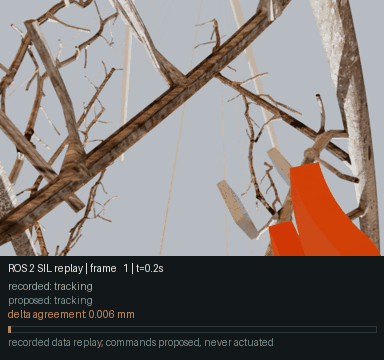

# ROS 2 software-in-the-loop — September 23, 2026

The perception-to-control loop runs as a ROS 2 Humble system on recorded sensor
streams. The node adds no perception and no control law: it imports the existing
`VisionPruningDemo`, which already owns the tracker, the bounded Cartesian
command and the closure and geometry gates.

**This is software-in-the-loop. It is not hardware-in-the-loop.** Every input is
a recorded Isaac capture. No physical VL53L8CX, camera or UR5e has been driven
by this node, and proposed commands are published, never actuated.

## Result

Replaying capture `21328323` through the node reproduces the recorded run:

| Measure | Result |
|---|---|
| Frames compared | 199 of 200 |
| Decision-state agreement | **199 / 199** |
| Command delta error | median 0.07 mm, p95 0.68 mm, **max 1.995 mm** |
| Stated command tolerance | 2 mm |
| RGB-blackout control | 39 / 39 frames held, 0 approaches or releases |
| Depth-dropout control | 39 / 39 frames held, 0 approaches or releases |

Evidence: [`docs/evidence/ros2_sil_parity_2026-09-23.json`](evidence/ros2_sil_parity_2026-09-23.json),
which records every frame, not just the summary.



The animation above is the replay running: each frame shows the recorded
decision state, the state this node proposed, and how closely the command delta
agreed, against the 2 mm tolerance bar.

The one frame not compared is frame 0, where the capture records
`controller_source_frame_index = -1`: no image had been observed yet. The node
publishes an explicit `hold` with reason `no_camera_observation` and **no pose**,
rather than inventing a command.

### Where the small disagreement comes from

The evidence reports two errors, because they mean different things. The
tracker's estimated branch position differs from the recording by a median of
**2.7 mm**, while the proposed command differs by a median of **0.07 mm** — the
measurement error is the larger of the two.

That ordering is the interesting part. The tracker is iterative: its feature set
evolves from frame 0, so any floating-point difference between this host and the
recording host accumulates in the position estimate. The command is a *bounded*
step toward that estimate, so the bound attenuates the accumulated perception
difference rather than passing it through. A command error larger than its
measurement error would have pointed at the control path; it does not.

Two hypotheses were tested and rejected. Rebuilding with OpenCV 4.11.0, the
version the capture was recorded with, produced **identical** numbers, so the
OpenCV version is not the cause. Decision states agree exactly in every frame,
so the divergence never changes a decision.

## Running it

Everything runs in an Apptainer image built from the official ROS 2 Humble
`ros-base`, defined in [`ros2/containers/pruning_sil_humble.def`](../ros2/containers/pruning_sil_humble.def):

```bash
export APPTAINER_CACHEDIR=/nfs/hpc/share/$USER/apptainer-cache
export APPTAINER_TMPDIR=/nfs/hpc/share/$USER/apptainer-tmp
apptainer pull ros-humble-ros-base.sif docker://ros:humble-ros-base
apptainer build --fakeroot pruning_sil_humble.sif ros2/containers/pruning_sil_humble.def
```

Home directories on this cluster are small, hence the cache and temp overrides.

Export a capture to a bag, then replay it as a graph:

```bash
# Capture -> rosbag2. MCAP is the default storage.
python3 -m pruning_sil.export_rosbag2 \
  --capture-dir artifacts/isaac_render/job_21328323 \
  --output /scratch/$USER/sil-bag

# Player publishes recorded sensors; the servo node proposes commands from them.
ros2 launch pruning_sil sil_replay.launch.py \
  capture_dir:=artifacts/isaac_render/job_21328323

# Reproduce the parity evidence above.
python3 -m pruning_sil.parity \
  --capture-dir artifacts/isaac_render/job_21328323 \
  --output docs/evidence/ros2_sil_parity_<date>.json
```

An RViz2 layout is at [`ros2/pruning_sil/config/pruning_sil.rviz`](../ros2/pruning_sil/config/pruning_sil.rviz):
wrist RGB, wrist depth, TF, and the recorded and proposed command poses side by
side. The proposed pose is labelled advisory in the display name, because a
viewer should never mistake it for something the robot executed.

## Interface

### Topics, types and frames

| Topic | Type | Frame | QoS |
|---|---|---|---|
| `/pruning/wrist/image_raw` | `sensor_msgs/Image` (`rgb8`) | `mock_pruner__wrist_camera_optical_frame` | sensor data |
| `/pruning/wrist/depth` | `sensor_msgs/Image` (`32FC1`, metres, optical-Z) | same | sensor data |
| `/pruning/wrist/camera_info` | `sensor_msgs/CameraInfo` | same | sensor data |
| `/pruning/tof/{left,right}/distance` | `std_msgs/Float32MultiArray` (8×8, metres) | `mock_pruner__tof{0,1}` | sensor data |
| `/pruning/tof/{left,right}/valid` | `std_msgs/UInt8MultiArray` (8×8) | same | sensor data |
| `/joint_states` | `sensor_msgs/JointState` | — | reliable |
| `/pruning/tool_pose` | `geometry_msgs/PoseStamped` | `base_link` → `mock_pruner__tool0` | reliable |
| `/tf`, `/tf_static` | `tf2_msgs/TFMessage` | — | reliable |
| `/pruning/recorded/command_pose` | `geometry_msgs/PoseStamped` | `base_link` | reliable |
| `/pruning/recorded/release` | `std_msgs/String` (JSON) | — | reliable |
| `/pruning/proposed/command_pose` | `geometry_msgs/PoseStamped` | `base_link` | reliable |
| `/pruning/proposed/decision` | `std_msgs/String` (JSON) | — | reliable |

Images and time-of-flight grids use sensor-data QoS (best effort, depth 5), so a
slow subscriber drops samples rather than stalling the pipeline. Commands and
decisions are reliable: losing a `hold` decision is not an acceptable failure
mode, even in replay.

Depth is `32FC1` in metres along the optical Z axis, not ray length, and not
millimetres. Non-hits stay non-finite rather than becoming a plausible range.

Every message is stamped with the capture's recorded time, not wall-clock time.

### Mapping to the real rig

The pinned packages are in `third_party/sources.yaml` and fetched under
`third_party/src/branch_detection_system`. Their repository root is
`NOASSERTION` and their integration is `fetch_only`, so this package **maps** to
their interface rather than vendoring it, and builds without them.

| This package | Real rig | Note |
|---|---|---|
| `/pruning/tof/{left,right}/distance`, `Float32MultiArray`, metres | `/microROS/vl53l8cx/distance`, `vl53l8cx_msgs/Vl53l8cx8x8`, int32 **millimetres** | The real packet is unstamped and carries both sensors; the filtered stream `/vl53l8cx/distance_filtered` is `Vl53l8cx8x8Filtered` with a header and float64. Upstream also exposes `tof0_filtered` / `tof1_filtered`. |
| `/joint_states`, `sensor_msgs/JointState` | `/joint_states`, `sensor_msgs/JointState` | Same topic and type. |
| `/pruning/proposed/command_pose`, `PoseStamped` | `/servo_node/delta_twist_cmds`, `geometry_msgs/TwistStamped` | The rig is driven through MoveIt Servo, which takes a **velocity**. This node proposes a bounded position delta per frame; a bring-up divides by the control period. At the recorded 10 Hz that divisor is 0.1 s. **This conversion is not exercised here.** |
| `/pruning/wrist/image_raw` | rig-specific camera driver | The simulated wrist camera is a simulation-defined mount with no hardware calibration, so no real topic is claimed. |

One deliberate divergence: `vl53l8cx_msgs/Row8x8` declares `stride 8` and
`Column8x8` declares `stride 1`, because their stride is the step between
elements. `std_msgs/MultiArrayDimension` defines stride as the number of elements
the dimension spans, which is 64 and 8. Labels and sizes are copied exactly;
both strides differ. Copying their values would produce a `MultiArray` that every
standard consumer reads wrongly, so a bridge must translate. Both conventions are
recorded in `pruning_sil/topics.py` as `TOF_STRIDES_REAL` and `TOF_STRIDES_ROS`.

The VL53L8CX firmware evidence records continuous 8×8 operation at **15 Hz** in
raw millimetres. The replayed captures run at their own **10 Hz** capture rate.
Those are different numbers and neither is a latency claim.

## What would change for hardware

- **Sensor rate.** 15 Hz sensor against a 10 Hz replay. Freshness gates are
  written against capture time and would need real timestamps and a real clock.
- **Command type.** Position delta to `TwistStamped`, divided by the true control
  period, through MoveIt Servo with its own limits and collision checking.
- **Depth.** RTX optical-Z ground truth becomes a real depth sensor with noise,
  dropout, multipath and its own validity semantics.
- **Camera calibration.** The wrist mount is simulation-defined. Identifying the
  physical camera model and its calibrated optical transform is an open roadmap
  gate, not something this package supplies.
- **Target identity.** Branch identity, axis and radius come from scene metadata
  through `capture_dir`. On a rig that input must come from a perception stage,
  and this repository has no learned branch recognition.
- **Safety.** Nothing here is actuated. Anything driving hardware needs an
  authority model, an e-stop path and contact limits that this replay does not
  implement.

## What is not claimed

- Not hardware-in-the-loop, and never described as such.
- No physical sensor or robot has been driven.
- Proposed commands are advisory and are never actuated.
- Replay timings are replay timings, not latency or real-time guarantees.
- Parity is against **one** capture, `21328323`. It says nothing about captures
  the node has not replayed.
- Agreement of a replay with its own recording is reproducibility, not evidence
  that either is correct.

## C++ component

`ros2/pruning_sil_cpp` ports the time-of-flight deprojection
(`isaaclab_pruning.baselines.tof_servo.deproject_tof`) to C++17 with
`ament_cmake` and gtest. It is geometry only: no control law, no hardware.

The parity test is the point. `test/tof_parity_fixture.json` holds reference
points produced by the **Python** implementation on real recorded 8×8 grids from
`21328323` — five frames × two sensors, 232 valid zones — and the C++ test
compares against those to 1e-9 m. The port is checked against what it claims to
reproduce, not against itself.

Invalid zones produce NaN, and a test asserts they never become the sensor
offset. A gate has to be able to tell "no measurement" from "a measurement at
the origin"; silently substituting a number erases that difference.

## Continuous integration

[`.github/workflows/ros2.yml`](../.github/workflows/ros2.yml) runs `colcon build`
and `colcon test` on both packages in a `ros:humble-ros-base` container.
`ros-base` rather than `ros:humble`, because rosbag2 is not in the core image.

Tests run against the procedural fixture in `ros2/pruning_sil/test/fixture.py`,
which builds its own textured scene. No orchard mesh, bark texture, mock-pruner
CAD or recorded capture exists on a clean runner, and the capture-dependent
parity test skips itself. A final step fails the build if any 3D asset appears in
the workspace, so a licensed asset cannot reach CI unnoticed.
